# Eco Essentials — Data Warehouse Project

An end-to-end data warehousing solution for **Eco Essentials**, an eco-friendly cookware company. This project designs, builds, tests, and visualizes a dimensional model that unifies transactional sales data with Salesforce Marketing Cloud email events — enabling leadership to analyze sales trends and measure marketing campaign effectiveness.

---

## Table of Contents

1. [Project Overview](#project-overview)
2. [Architecture](#architecture)
3. [Dimensional Modeling](#dimensional-modeling)
4. [Extract, Load & Transform (ELT)](#extract-load--transform-elt)
5. [Testing & Scheduling](#testing--scheduling)
6. [Business Questions](#business-questions)
7. [Reporting & Visualization](#reporting--visualization)
8. [Tech Stack](#tech-stack)
9. [Repository Structure](#repository-structure)

---

## Project Overview

Eco Essentials wants to optimize its data infrastructure to gain deeper insights into operations and customer behavior. As consultants, we designed and implemented a data warehouse that supports two core business processes:

| # | Business Process | Goal |
|---|------------------|------|
| 1 | **Sales** | Report on the sales of individual items on overall transactions for an individual customer. |
| 2 | **Marketing Email Conversion** | Report on marketing emails to customers and leads to report on click and purchase rate |

### Data Sources

| Source | Platform | Description |
|--------|----------|-------------|
| Transactional Database | Amazon RDS (Postgres) | Online purchase records — orders, customers, products, campaigns |
| Marketing Email Events | AWS S3 Bucket | Salesforce Marketing Cloud email event data — sends, opens, clicks |

**Transactional database ERD**

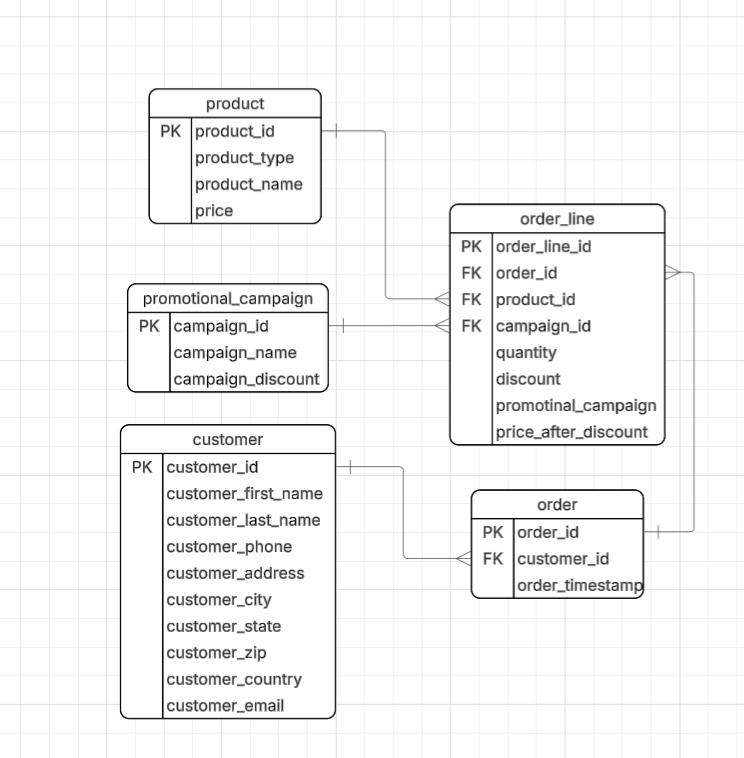

**Marketing email ERD**

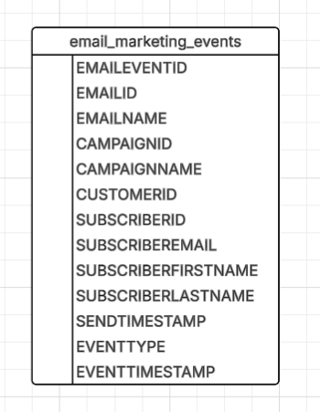

---

## Architecture

```
┌──────────────────┐     ┌──────────────────┐
│  Amazon RDS      │     │  AWS S3 Bucket   │
│  (Postgres)      │     │  (Email Events)  │
└────────┬─────────┘     └────────┬─────────┘
         │                        │
         │        Fivetran        │
         │      (Extract &        │
         └────────Load)───────────┘
                   │
                   ▼
         ┌─────────────────┐
         │    Snowflake     │
         │  Landing Tables  │
         │  (raw schema)    │
         └────────┬────────┘
                  │
                  │  dbt (Transform)
                  ▼
         ┌─────────────────┐
         │    Snowflake     │
         │  dw_ecoessentials│
         │  (Star Schema)   │
         └────────┬────────┘
                  │
                  ▼
         ┌─────────────────┐
         │    Power BI      │
         │   Dashboard      │
         └─────────────────┘
```

---

## Dimensional Modeling

### Bus Matrix

| Business Process | Date | Time | Customer | Product | Campaign | Email | Event |
|------------------|:----:|:----:|:--------:|:-------:|:--------:|:-----:|:-----:|
| Sales            |  ✓   |      |    ✓     |    ✓    |    ✓     |       |       |
| Email Conversion |  ✓   |  ✓   |    ✓     |         |    ✓     |   ✓   |   ✓   |

### Star Schema — Sales Process

- **Business Process:** Item-level sales transactions
- **Grain:** One row per item purchased by a customer on a given date
- **Fact Table:** `fact_itemsold`
- **Dimensions:** `e_dim_date`, `e_dim_customer`, `e_dim_campaign`, `e_dim_product`
- **Measures:** Price, Quantity, Price Discount, OrderID

### Star Schema — Marketing Email Conversion

- **Business Process:** Email marketing interactions
- **Grain:** One row per subscriber + email + interaction event
- **Fact Table:** `fact_emailevent`
- **Dimensions:** `e_dim_date`, `e_dim_customer`, `e_dim_campaign`, `e_dim_email`, `e_dim_event`, `e_dim_time`

### Conformed Dimensions

The following dimensions are **conformed** (shared) across both star schemas, ensuring consistency in the enterprise data warehouse:

| Conformed Dimension | Description |
|---------------------|-------------|
| **`e_dim_date`** | Shared calendar dimension enabling cross-process time analysis |
| **`e_dim_customer`** | The key bridge that allows Eco Essentials to trace the full funnel: marketing email → click → purchase. |
| **`e_dim_customer`** | Links email recipients to purchasers, enabling conversion tracking |

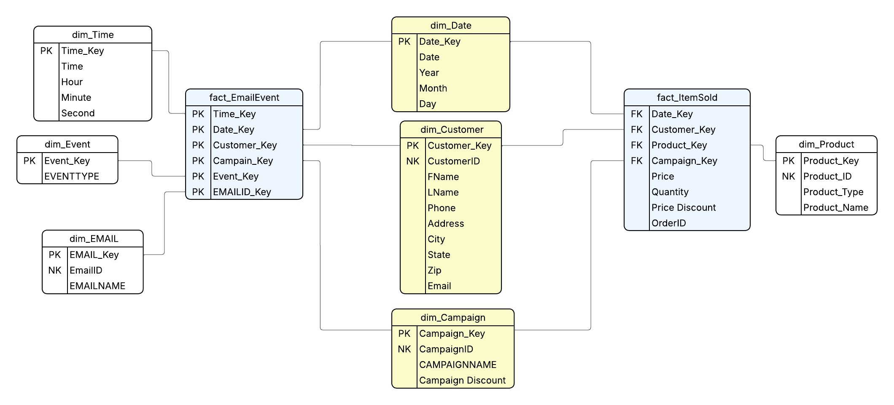

---

## Extract, Load & Transform (ELT)

### Extract & Load (Fivetran)

Two Fivetran connectors were configured:

1. **Amazon RDS Connector** — Extracts tables from the Postgres transactional database and loads them into Snowflake landing tables.
2. **AWS S3 Connector** — Extracts Salesforce Marketing Cloud email event CSV/JSON files and loads them into Snowflake landing tables.

Landing tables are stored in a dedicated schema within the personal Snowflake database.

### Transform (dbt)

dbt models transform the raw landing data into the dimensional model under the `dw_ecoessentials` schema.

**Surrogate Key Generation:**

```sql
{{ dbt_utils.generate_surrogate_key(['column_name1', 'column_name2']) }}
```

### dbt Models

| Model | Type | Description |
|-------|------|-------------|
| `e_dim_campaign` | Dimension | Marketing campaign details and discount info |
| `e_dim_customer` | Dimension | Customer attributes (conformed) |
| `e_dim_date` | Dimension | Calendar dimension (conformed) |
| `e_dim_time` | Dimension | Time-of-day dimension (conformed) |
| `e_dim_product` | Dimension | Product catalog with product types |
| `e_dim_email` | Dimension | Marketing email metadata |
| `e_dim_event` | Dimension | Email event types (SENT, OPEN, CLICK) |
| `fact_itemsold` | Fact | Items purchased by customers |
| `fact_emailevent` | Fact | Customer interactions with marketing emails |

Model code can be viewed in the [`models/ecoessentials/`](models/ecoessentials/) directory. See individual model files for details.

### dbt Lineage

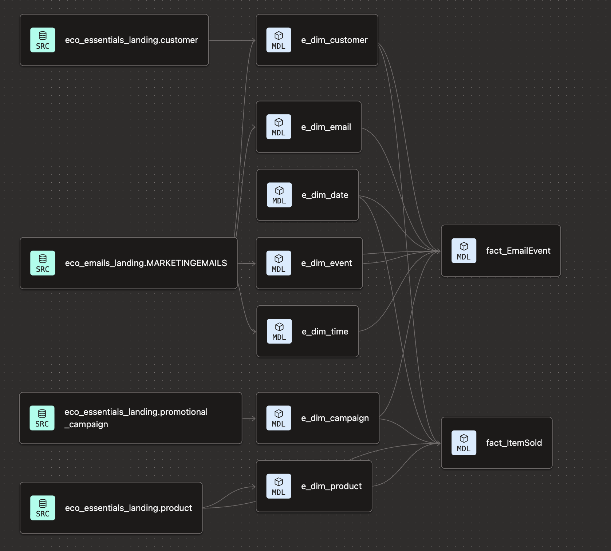

### Snowflake Tables

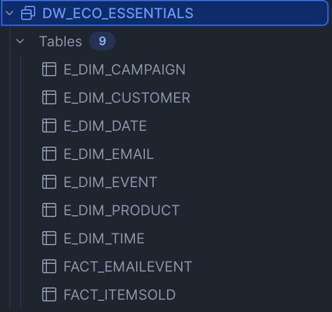

### Snowflake Test Queries
<details>
  <summary><strong>Query 1:</strong> Top 3 product types by revenue</summary>

```sql
--What 3 products generate the highest revenue per customer over a specific period?
SELECT
    p.Product_Type,
    ROUND(SUM(i.Price * (1 - i.Discount) * i.Quantity), 2) AS Revenue
FROM fact_itemsold i
JOIN e_dim_product p ON i.product_key = p.product_key
    JOIN e_dim_date d ON i.date_key = d.date_key
GROUP BY p.Product_Type
ORDER BY Revenue DESC
LIMIT 3;
```

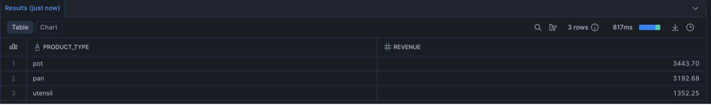
</details>

<details>
  <summary><strong>Query 2:</strong> Average order value per customer segmented by month</summary>

```sql
--What is the average order value per customer segmented by month?
SELECT
    d.Month,
    ROUND(SUM(s.Price * (1 - s.Discount) * s.Quantity) / COUNT(DISTINCT customer_key), 2) AS avg_order_value_per_customer
FROM fact_itemsold s JOIN e_dim_date d 
    ON s.date_key = d.date_key
GROUP BY ALL
ORDER BY d.month;
```

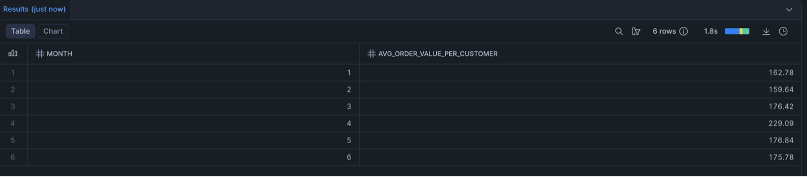
</details>

<details>
  <summary><strong>Query 3:</strong> Customer engagement tiers, revenue, and purchase frequency</summary>

```sql
/*How can customers be segmented into engagement tiers based on their email
interaction behavior, and how does each segment differ in total revenue and purchase
frequency?*/
WITH email_engagement AS (
SELECT
    customer_key,
    COUNT(*) AS total_events
FROM fact_emailevent
GROUP BY customer_key
),
purchase_data AS (
SELECT
    customer_key,
    SUM(Price * (1 - Discount) * Quantity) AS revenue,
    COUNT(*) AS purchase_frequency
FROM fact_itemsold
GROUP BY customer_key
)
SELECT
    CASE
        WHEN e.total_events = 3 THEN 'High Engagement'
        WHEN e.total_events = 2 THEN 'Medium Engagement'
        ELSE 'Low Engagement'
        END AS EngagementTier,
    COUNT(*) AS Customers,
    ROUND(SUM(p.revenue), 2) AS TotalRevenue,
    ROUND(AVG(p.purchase_frequency), 2) AS AvgPurchaseFrequency
FROM email_engagement e
JOIN purchase_data p 
    ON e.customer_key = p.customer_key
GROUP BY EngagementTier
ORDER BY TotalRevenue DESC;
```

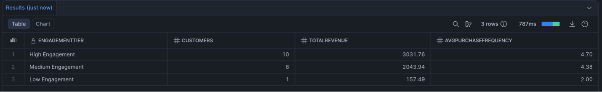
</details>

---

## Testing & Scheduling

### dbt Tests

Each model includes at least one test. All four built-in dbt test types are used across the project:

| Test Type | Model(s) Applied | Column |
|-----------|-----------------|--------|
| `unique` | `e_dim_customer`, `e_dim_date` | `customer_key`, `date_key` |
| `not_null` | `e_dim_campaign`, `e_dim_email`, `e_dim_time` | `campaign_discount`, `emailid`, `time_key` |
| `accepted_values` | `e_dim_event` | `eventtype` → SENT, OPEN, CLICK |
| `accepted_values` | `e_dim_product` | `product_type` → storage, cutting_board, utensil, accessory, pot, pan |
| `relationships` | `fact_emailevent` | `customer_key` → `e_dim_customer.customer_key` |
| `relationships` | `fact_itemsold` | `campaign_key` → `e_dim_campaign.campaign_key` |

### Schema YAML

The full test configuration is defined in [`_schema_ecoessentials.yml`](models/ecoessentials/_schema_ecoessentials.yml). See the file for details.

### Scheduling

| Component | Frequency | Details |
|-----------|-----------|---------|
| Fivetran Connectors (×2) | Every 24 hours | Both RDS and S3 connectors set to daily sync |
| dbt Job | Daily | Builds all fact and dimension models after Fivetran sync completes |

<details>
  <summary><strong>RDS connector sync</strong></summary>

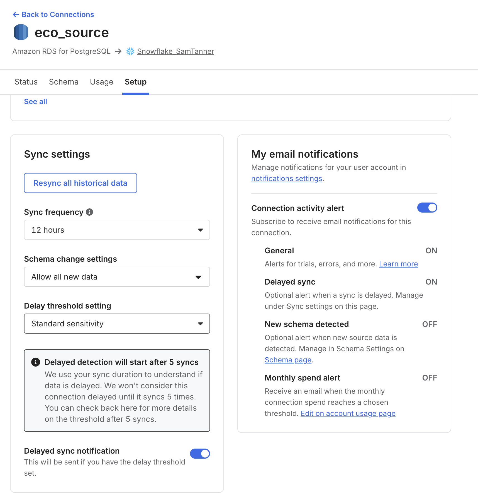
</details>

<details>
  <summary><strong>S3 connector sync</strong></summary>

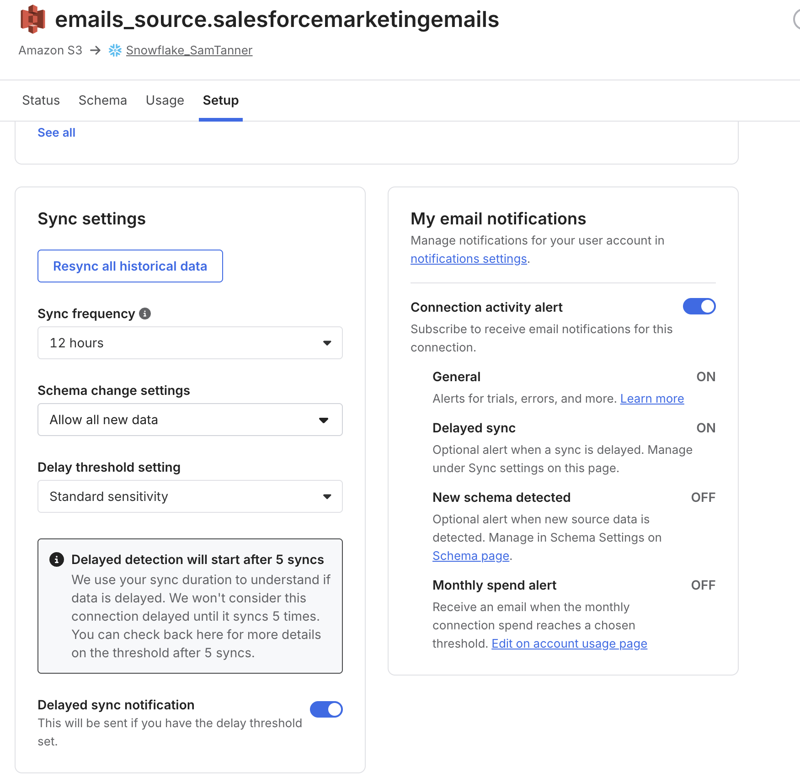
</details>

<details>
  <summary><strong>Successful sync run</strong></summary>

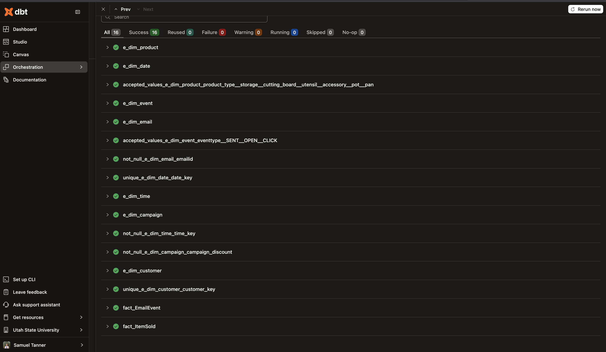
</details>

<details>
  <summary><strong>dbt schedule</strong></summary>

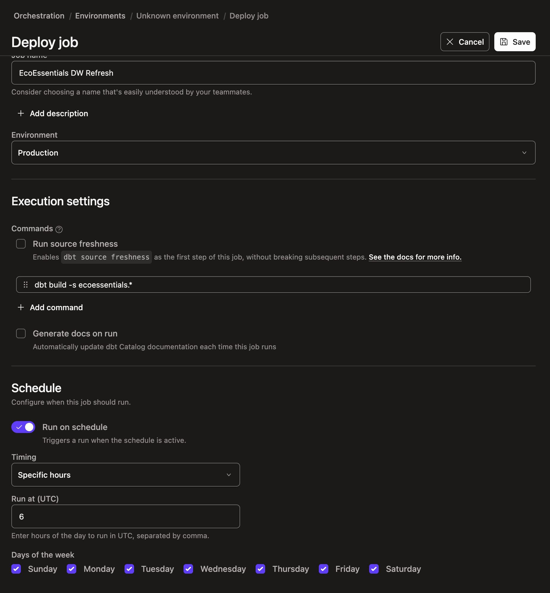
</details>

---

## Business Questions

This warehouse is designed to help Eco Essentials answer practical leadership questions across sales performance, campaign effectiveness, and customer behavior:

1. Which campaigns generate the highest total revenue and strongest click-to-purchase conversion?
2. Which product categories and product types drive the most revenue by month and by customer segment?
3. How does average order value change over time, and which months show the strongest performance?
4. Which customer segments (by engagement tier, geography, or repeat behavior) contribute the most long-term value?
5. What is the relationship between email engagement events (sent, open, click) and downstream purchases?
6. Where are marketing drop-off points in the funnel, and which stage has the biggest opportunity for improvement?

---

## Reporting & Visualization

A **Power BI** dashboard was built for Eco Essentials leadership. The static view highlights performance across revenue, campaign conversion, customer geography, and product mix in one executive panel.

### Dashboard Snapshot

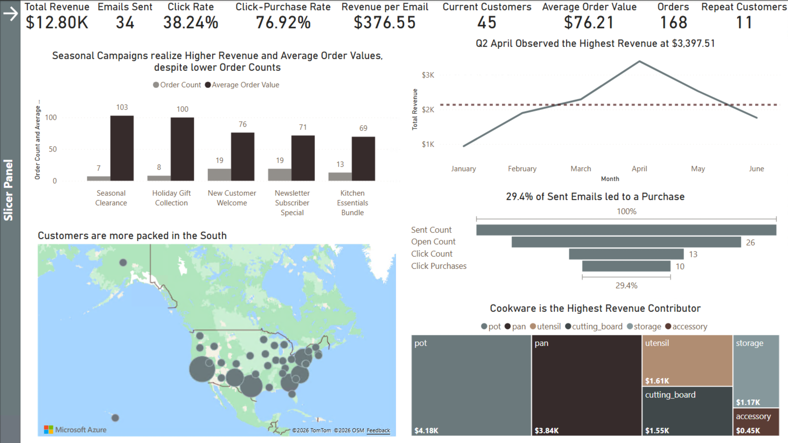

### What the dashboard shows

The default dashboard view is filtered to the **five campaigns with the highest total revenue**.

The report combines multiple visual types, including a **spatial map**, **side-by-side bar chart**, **funnel chart**, **treemap**, **line chart**, and **KPI cards**.

- **Executive KPIs:** Total Revenue ($12.80K), Emails Sent (34), Click Rate (38.24%), Click-Purchase Rate (76.92%), Revenue per Email ($376.55), Current Customers (45), Average Order Value (76), Orders (168), and Repeat Customers (11)
- **Campaign performance:** Seasonal Campaigns generate strong revenue and average order value despite fewer total orders
- **Monthly revenue trend:** April is the top month with the highest observed revenue (~$3.4K), with growth from January to April followed by a decline into June
- **Email funnel conversion:** 29.4% of sent emails convert to purchases, with counts visible for sent, open, click, and click-purchase stages
- **Geographic distribution:** Customer concentration is strongest in the southern United States
- **Product contribution:** Cookware categories `pot` and `pan` contribute the most total revenue, with additional support from `utensil`, `cutting_board`, and `storage`

### Dashboard file

[Download the interactive Power BI file (`.pbix`)](files/EcoEssentials_Dashboard.pbix)

### Dashboard mechanics

- Open slicer panel: **Control + Click** the top-left arrow on the dashboard
- Available slicers: **Date** (slider), **Product** (dropdown), **State** (dropdown), and **Campaign** (dropdown)
- Close slicer panel: **Control + Click** the `X` button or click anywhere on the dashboard canvas
---

## Tech Stack

| Layer | Technology |
|-------|-----------|
| Source Systems | Amazon RDS (Postgres), AWS S3 |
| Ingestion | Fivetran |
| Data Warehouse | Snowflake |
| Transformation | dbt (with dbt_utils) |
| Testing | dbt built-in tests |
| Orchestration | dbt Cloud Jobs, Fivetran Scheduling |
| Visualization | Power BI |
| Version Control | GitHub |

---

## Repository Structure

```
├── README.md
├── models/
│   ├── _schema_ecoessentials.yml            # dbt tests & documentation
│   ├── _src_ecoessentials.yml            # RDS Source config
│   ├── _src_emails.yml            # S3 Source config 
│   ├── dimensions/
│   │   ├── e_dim_campaign.sql
│   │   ├── e_dim_customer.sql
│   │   ├── e_dim_date.sql
│   │   ├── e_dim_time.sql
│   │   ├── e_dim_product.sql
│   │   ├── e_dim_email.sql
│   │   └── e_dim_event.sql
│   └── facts/
│       ├── fact_itemsold.sql
│       └── fact_emailevent.sql
└── files/                     # ERDs, Models, images
```